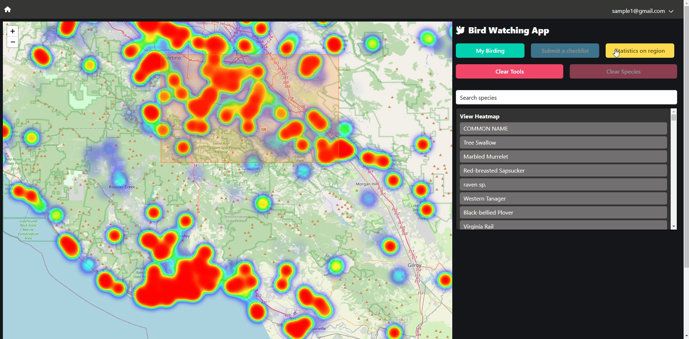
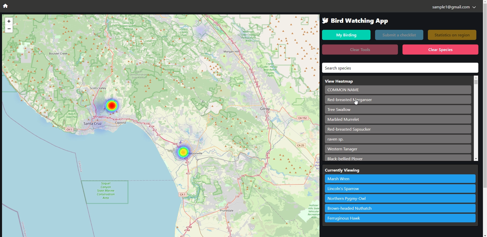
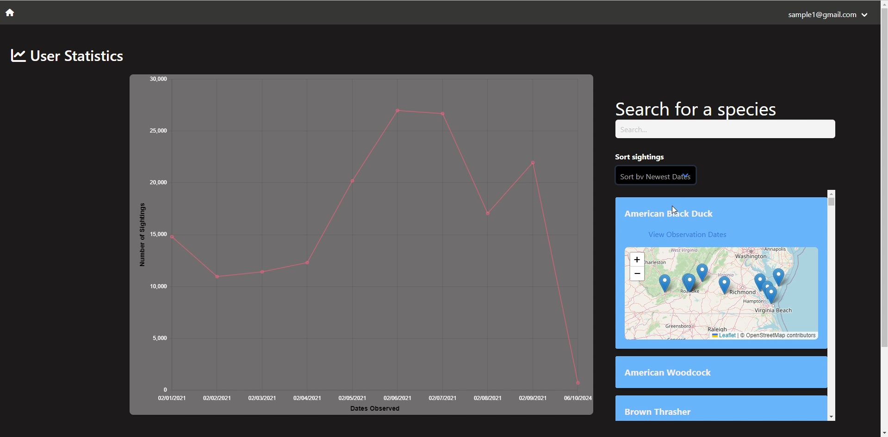
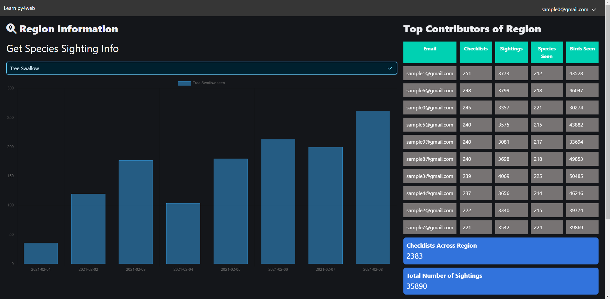

# Bird Watching App

## Overview

The Bird Watching App is a web application designed for bird enthusiasts to log sightings, explore statistics, and discover birding locations. Modeled loosely on ebird.org, this project integrates Vue.js for frontend development, Leaflet.js for mapping, Chart.js for data visualization, and Bulma CSS for styling.

## Features

### Index Page
- Welcomes users with a map displaying bird densities in their region.
- Allows users to draw a rectangle on the map to view statistics for that region.
- Provides a species selection box to filter displayed bird densities.
- Links to checklist submission page and user statistics page.
  
 

### Checklist Page

- Enables users to log bird sightings for a specific location chosen on the map.
- Includes a species search bar with autocomplete for ease of use.
- Allows users to enter the number of birds seen for each species and submit their checklist.
- Provides a page where users can view, edit, or delete their submitted checklists.

### User Statistics Page

- Displays user-specific statistics such as all species seen and trends over time.
- Offers visualizations using Chart.js to showcase birding trends and sightings.
- Utilizes Leaflet.js to display location of each bird sighting
  

  

### Location Page

- Allows users to select a region on the map and view detailed statistics for that region.
- Displays a list of species observed in the region with the number of sightings.
- Includes graphs using Chart.js to illustrate bird sightings over time for selected species.
- Provides information on top contributors for the region.
  

## Development

### Technologies Used

- **Vue.js**: Used for building responsive, single-page applications.
- **Leaflet.js**: Integrated with OpenStreetMap tiles to display bird densities and allow user interactions like drawing rectangles.
- **Chart.js**: Utilized for creating interactive charts and graphs to visualize birding statistics.
- **Bulma CSS**: Provides extensive styling for a clean and modern user interface.

### Database Schema

- Ensure to first develop and agree upon the database schema.
- Use synthetic data (provided or generated) to test and develop the pages.

### Sample Data

- The app uses three CSV files (species.csv, checklists.csv, sightings.csv) to populate the database.
- Python scripts can be used to read these CSV files and insert data into the database.

### Project Setup

1. Clone the repository.
2. Set up the database schema and load sample data.
3. Install dependencies using `npm install`.
4. Access the application on `http://localhost:8080` (or as configured).

## Contributors

- Each main page (Index, Checklist, Stats, Location) can be developed by different team members.
- Coordinate effectively using Git and project management tools to ensure smooth collaboration.

## License

- This project is licensed under the [MIT License](LICENSE).
